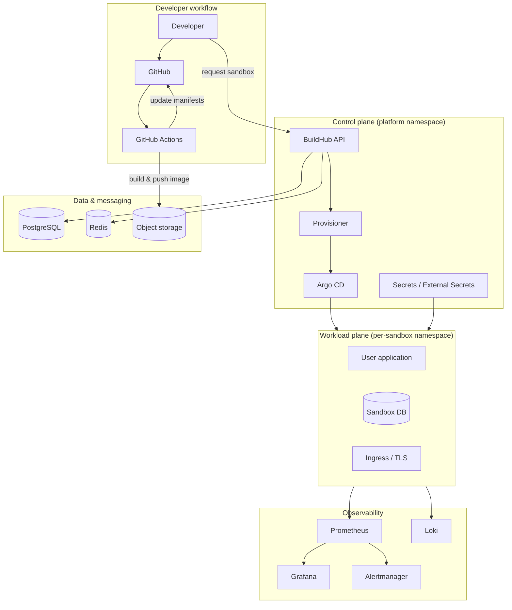

# BuildHub

**A self-service platform for provisioning, building, testing, and shipping backend practice projects — built the way production platforms are.**

[](LICENSE)
[](https://kubernetes.io/)
[](https://www.terraform.io/)
[](https://argo-cd.readthedocs.io/)

---

## Why this project exists

Most backend portfolios show *what* you built. **BuildHub shows how you ship.**

Backend engineers need realistic sandboxes: isolated environments, databases, CI pipelines, and deploy targets — without waiting on a platform team or wrestling with YAML at 2 a.m. BuildHub is the platform layer that makes that possible.

This repository is my **DevOps / Platform Engineering portfolio piece**. It demonstrates how I design, automate, secure, and operate infrastructure that other engineers depend on every day — not a toy script, but a coherent internal developer platform (IDP) with the same primitives you'd see at a growth-stage product company.

> **If you're hiring for DevOps, SRE, or Platform Engineering:** you're looking for someone who thinks in systems, automates the boring parts, and leaves a clear audit trail. That's what BuildHub is built to prove.

---

## What BuildHub does

| Capability | What it means in practice |
|------------|---------------------------|
| **Self-service environments** | Engineers pick a project template and get a namespaced sandbox (app + DB + ingress) in minutes, not days. |
| **Immutable builds** | Every commit runs through lint, test, SAST, and container build; artifacts are versioned and traceable. |
| **GitOps delivery** | Cluster state is declared in Git; ArgoCD reconciles. Rollbacks are a revert, not a panic. |
| **Observable by default** | Metrics, logs, and alerts ship with every environment — not bolted on after an outage. |
| **Policy at the gate** | OPA/Gatekeeper and image scanning block non-compliant workloads before they reach the cluster. |
| **Cost-aware isolation** | Per-environment quotas, autoscaling, and teardown policies keep sandboxes from becoming budget leaks. |

---

## Architecture

BuildHub follows a **control plane + workload plane** split: platform services manage provisioning and policy; user workloads run in isolated namespaces with strict boundaries.



### Design decisions (and why they matter)

1. **Kubernetes as the unit of isolation** — Namespaces, NetworkPolicies, and ResourceQuotas give hard boundaries between sandboxes without provisioning full VMs per user.
2. **Terraform for cloud foundation** — VPC, EKS (or k3s for local), IAM, RDS, S3, and DNS are reproducible across `dev`, `staging`, and `prod` with the same modules.
3. **Helm + Kustomize for app packaging** — Base charts for "sandbox stack" (app, DB sidecar or managed endpoint, ingress); overlays per environment.
4. **GitOps over imperative deploys** — The cluster never becomes a snowflake; every change is reviewable and auditable.
5. **Secrets never in Git** — External Secrets Operator pulls from Vault or cloud secret managers; rotation doesn't require redeploying the whole platform.
6. **Progressive delivery ready** — Structure supports canary/analysis hooks (Argo Rollouts) when sandboxes graduate to shared staging.

---

## Technology stack

| Layer | Tools | Role |
|-------|-------|------|
| **Cloud / IaC** | Terraform, AWS (EKS, RDS, S3, Route53) | Foundation, networking, managed services |
| **Orchestration** | Kubernetes, Helm, Kustomize | Workload scheduling and packaging |
| **GitOps** | Argo CD | Continuous deployment from Git |
| **CI** | GitHub Actions | Build, test, scan, publish |
| **Registry** | ECR (or GHCR) | Immutable container artifacts |
| **Secrets** | Vault / AWS Secrets Manager + External Secrets | Centralized secret lifecycle |
| **Policy** | OPA Gatekeeper, Trivy, tfsec | Admission control and supply-chain security |
| **Observability** | Prometheus, Grafana, Loki, Alertmanager | Metrics, dashboards, logs, paging |
| **Ingress / TLS** | ingress-nginx or Traefik, cert-manager | HTTPS and routing |
| **Local dev** | kind / k3d, Tilt or Skaffold | Fast feedback without cloud spend |

---

## Repository layout (target structure)

```
buildhub/
├── terraform/           # Cloud foundation (VPC, EKS, RDS, IAM)
│   ├── modules/
│   └── environments/    # dev | staging | prod
├── kubernetes/
│   ├── platform/        # Argo CD, monitoring, ingress, policies
│   ├── apps/            # BuildHub control-plane manifests
│   └── sandboxes/       # Template overlays for user environments
├── helm/
│   └── sandbox-stack/   # Reusable chart: app + db + ingress
├── .github/
│   └── workflows/       # CI, security scans, GitOps sync checks
├── scripts/             # Bootstrap, local cluster, smoke tests
└── docs/
    ├── runbooks/        # Incident response, rollback, DR
    └── architecture/    # ADRs and deep dives
```

---

## CI/CD pipeline

Every change to application or platform code follows the same path:

```
┌─────────────┐   ┌─────────────┐   ┌─────────────┐   ┌─────────────┐   ┌─────────────┐
│   Commit    │──▶│  Lint/Test  │──▶│  SAST/Scan  │──▶│ Build Image │──▶│ GitOps Sync │
│             │   │  unit+e2e   │   │ Trivy/tfsec │   │  + SBOM     │   │  Argo CD    │
└─────────────┘   └─────────────┘   └─────────────┘   └─────────────┘   └─────────────┘
```

**Pipeline guarantees:**

- Failed tests or critical CVEs **block merge** — no silent overrides.
- Images are tagged with `git sha` and promoted through environments via manifest updates, not re-tags.
- Platform drift is caught by `terraform plan` in CI and optional policy checks on Kubernetes manifests (`kubeconform`, `kyverno`).

---

## Security posture

BuildHub treats every sandbox as **multi-tenant untrusted**:

- **NetworkPolicies** — default deny; only ingress controller and required egress.
- **Pod Security** — restricted standards, no root, read-only root FS where possible.
- **Image provenance** — scan on build; admission webhook rejects critical findings.
- **IAM least privilege** — IRSA for pod-level AWS access; no long-lived cluster-admin for apps.
- **Audit** — Kubernetes audit logs + Git history for all infra changes.

---

## Observability & SLO thinking

Platform health is measured, not assumed:

| Signal | Example target | Alert if |
|--------|----------------|----------|
| Sandbox provision latency | p95 < 3 min | p95 > 5 min for 15m |
| Argo CD sync success | > 99% | failed syncs > 3 in 1h |
| API availability | 99.9% monthly | error rate > 1% for 5m |
| Node capacity | < 80% allocatable | sustained > 85% |

Runbooks live in `docs/runbooks/` — **provision failure**, **Argo sync stuck**, **certificate renewal**, **node pressure**.

---

## Skills demonstrated

This project is intentionally scoped to mirror real platform team work:

- **Infrastructure as Code** — modular Terraform, environment divergence, state separation
- **Kubernetes operations** — upgrades, autoscaling, quotas, troubleshooting production-like issues
- **CI/CD engineering** — fast pipelines, caching, security gates, deployment strategies
- **GitOps** — app-of-apps, sync waves, health assessment, rollback patterns
- **Observability** — RED/USE metrics, structured logging, actionable alerts (not alert spam)
- **Security engineering** — supply chain, secrets, policy-as-code, blast-radius reduction
- **Documentation** — architecture diagrams, ADRs, runbooks (operators matter)

---

## Getting started

### Prerequisites

- Docker, `kubectl`, Terraform >= 1.5, AWS CLI (or local kind/k3d)
- Helm 3, optional: Argo CD CLI

### Local platform bootstrap (planned)

```bash
# Clone and enter the repo
git clone https://github.com/Akum65358Blaise/buildhub.git
cd buildhub

# Bootstrap local Kubernetes + platform components
./scripts/bootstrap-local.sh

# Deploy control plane
kubectl apply -k kubernetes/platform/

# Verify
kubectl get pods -n buildhub-platform
```

### Cloud deployment (planned)

```bash
cd terraform/environments/dev
terraform init
terraform plan
terraform apply

# Install GitOps root app
kubectl apply -f kubernetes/platform/argocd/root-app.yaml
```

> **Note:** Implementation is in active development. The architecture and repository layout above reflect the target production design. Check [Project status](#project-status) for what's landed.

---

## Project status

| Area | Status |
|------|--------|
| Architecture & documentation | ✅ Defined |
| Terraform foundation | 🚧 In progress |
| Kubernetes platform stack | 🚧 In progress |
| BuildHub control-plane API | 📋 Planned |
| Sandbox provisioning automation | 📋 Planned |
| Full observability stack | 📋 Planned |
| Production hardening (DR, backups) | 📋 Planned |

---

## Roadmap

- [ ] **M1 — Foundation** — EKS + Terraform modules, Argo CD, ingress, cert-manager
- [ ] **M2 — Control plane** — API for sandbox lifecycle (create, status, destroy)
- [ ] **M3 — Developer UX** — Project templates, GitHub integration, preview URLs
- [ ] **M4 — Observability** — Dashboards per sandbox, log aggregation, SLO alerts
- [ ] **M5 — Enterprise patterns** — Multi-region DR, backup/restore, cost reporting

---

## Contributing

Contributions welcome. Please open an issue before large changes. For platform changes, include:

1. What problem it solves
2. Impact on security / cost / operability
3. Rollback plan

---

## License

MIT — see [LICENSE](LICENSE).

---

## Contact

**Built by Akum Blaise Acha** — DevOps / Platform Engineer

- GitHub: [@Akum65358Blaise](https://github.com/Akum65358Blaise)
- Email: [akumacha@gmail.com](mailto:akumacha@gmail.com)

---

<sub>BuildHub — because great backend engineers shouldn't have to fight infrastructure to prove they can build great backends.</sub>
